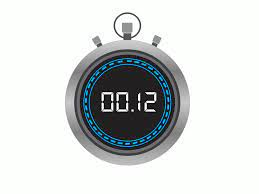

<!-- PROJECT LOGO -->
 

  <a href="https://github.com/Cerberus0013/timed-quiz"
    
  </a>

  <h3 align="center">Quiz Time</h3>

  

  Timed Quiz Challenge
         
        <a href="https://github.com/Cerberus0013/timed-quiz"><strong>Explore the docs »</strong></a>
         
         
        <a href="https://github.com/Cerberus0013/timed-quiz">View Demo</a>
        ·
        <a href="https://github.com/Cerberus0013/timed-quiz">Report Bug</a>
        ·
        <a href=""https://github.com/Cerberus0013/timed-quiz">Request Feature</a>
  

<!-- TABLE OF CONTENTS -->

  
<h2 style="display: inline-block">Table of Contents</h2>

  <ol>
    <li><a href="#about-the-project">About The Project</a></li>
    <li><a href="#project-links">Project Links</a></li>
    <li><a href="#contact">Contact</a></li>
  </ol>

<!-- ABOUT THE PROJECT -->
## About The Project

Features:

* Built using HTML, CSS, Java Script, DOM elements
* It wllows you to create a quiz with button style elements
* Once a button is clicked it takes you to the next question
* It can be used for an indefinite amount of questions

<!-- PROJECT LINKS -->
## Project Links

Hosted Link: [https://cerberus0013.github.io/timed-quiz/](https://cerberus0013.github.io/timed-quiz/)

Repository Link: [https://github.com/Cerberus0013/timed-quiz](https://github.com/Cerberus0013/timed-quiz)

<!-- CONTACT -->
## Contact

Brian Breedlove - brianbreedlove0013@gmail.com

Template from: https://github.com/othneildrew/Best-README-Template/blob/master/README.md

<!-- MARKDOWN LINKS & IMAGES -->
<!-- https://www.markdownguide.org/basic-syntax/#reference-style-links -->

